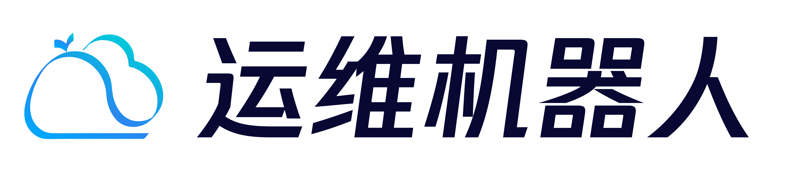
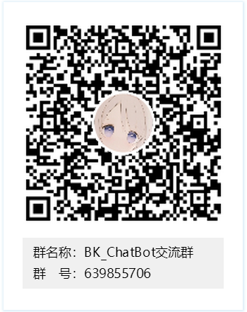

# bk-chatbot

## 产品简介

bk-chatbot 是一款可通过可视化的界面进行任务配置，通过聊天终端软件如企业微信应用机器人进行会话交互实现任务执行和智能问答的蓝鲸 SaaS 产品。

bk-chatbot 有两项核心服务，一为插件集成服务：目前默认集成了作业平台、标准运维和蓝盾平台，后续我们会陆续开放用户自定义插件服务；二为意图识别服务：用户任务配置中收集语料，通过 NLP 、相似度算法等技术训练成识别模型，用户通过与机器人聊天交互，精准匹配到您需要执行的任务。

使用 bk-chatbot ，可以更为方便快捷的执行运维作业，当你不在电脑旁，也可以通过手机端企业微信的交互实现运维作业的执行。

## Overview

### 使用场景

bk-chatbot 主要用于运维执行场景，如发布、变更、查询等执行类操作；通过企业微信机器人的交互，实现方便快捷的运维任务执行，无需登录社区版蓝鲸页面进行操作；同时非常适用于移动办公场景。

## Features

插件化接入支持：默认支持作业平台、标准运维平台等插件服务 ，作为官方标准插件提供服务，还支持用户自定义插件开发，定制开发标准插件。

聊天终端接入：默认支持企业微信应用机器人服务，还支持用户自定义加入其它终端软件如QQ、slack等机器人服务。

可交互的任务执行：与机器人发起会话时，可通过交互的方式获取到任务的参数。

通用权限管理：通过配置发起人角色，实现机器人技能的权限控制。

## Getting started

- [安装部署](docs/deploy.md)

## Usage

- [任务使用说明](docs/usage.md)
- [知识库使用说明](docs/knowledge.md)

## Roadmap

- [版本日志](docs/release.md)

## Support

- [蓝鲸论坛](https://bk.tencent.com/s-mart/community/)

- [蓝鲸 DevOps 在线视频教程](https://cloud.tencent.com/developer/edu/major-100008)

- 联系我们，加入 bk-chatbot 交流群：639855706
  
  

## BlueKing Community

- [BK-CI](https://github.com/Tencent/bk-ci)：蓝鲸持续集成平台是一个开源的持续集成和持续交付系统，可以轻松将你的研发流程呈现到你面前。
- [BK-BCS](https://github.com/Tencent/bk-bcs)：蓝鲸容器管理平台是以容器技术为基础，为微服务业务提供编排管理的基础服务平台。
- [BK-BCS-SaaS](https://github.com/Tencent/bk-bcs-saas)：蓝鲸容器管理平台SaaS基于原生Kubernetes和Mesos自研的两种模式，提供给用户高度可扩展、灵活易用的容器产品服务。
- [BK-PaaS](https://github.com/Tencent/bk-PaaS)：蓝鲸PaaS平台是一个开放式的开发平台，让开发者可以方便快捷地创建、开发、部署和管理SaaS应用。
- [BK-SOPS](https://github.com/Tencent/bk-sops)：标准运维（SOPS）是通过可视化的图形界面进行任务流程编排和执行的系统，是蓝鲸体系中一款轻量级的调度编排类SaaS产品。
- [BK-CMDB](https://github.com/Tencent/bk-cmdb)：蓝鲸配置平台是一个面向资产及应用的企业级配置管理平台。

## Contributing

如果你有好的意见或建议，欢迎给我们提 Issues 或 Pull Requests，为蓝鲸开源社区贡献力量。

### License

bk-chatbot基于 MIT 协议， 详细请参考 [LICENSE](https://github.com/TencentBlueKing/bk-chatbot/tree/master/LICENSE) 
