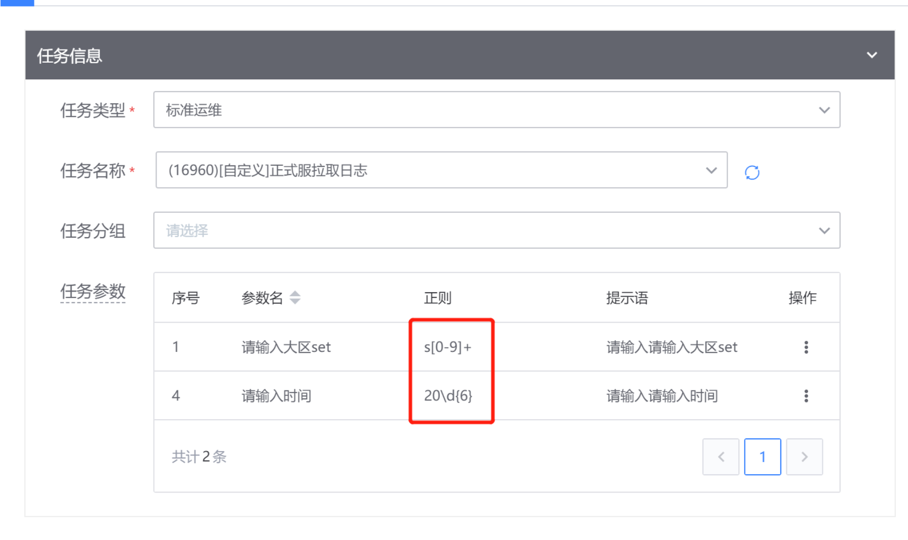
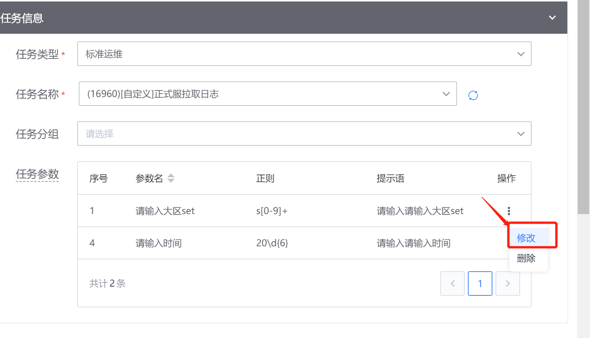
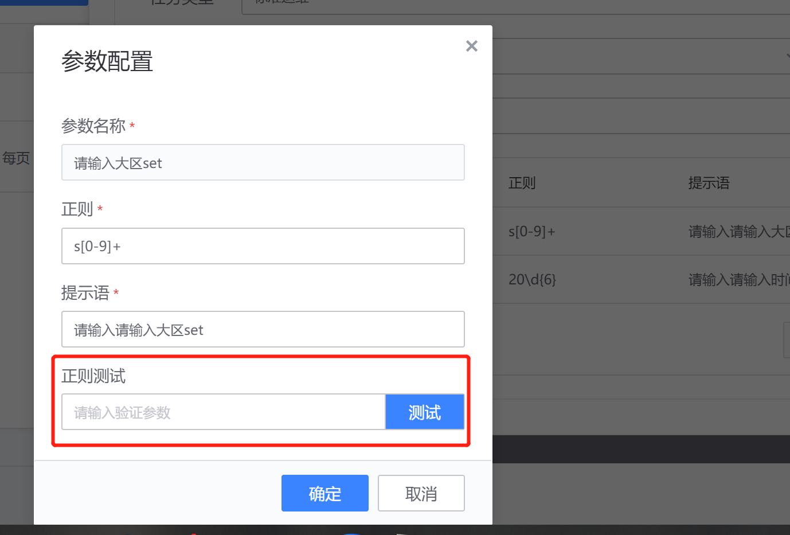
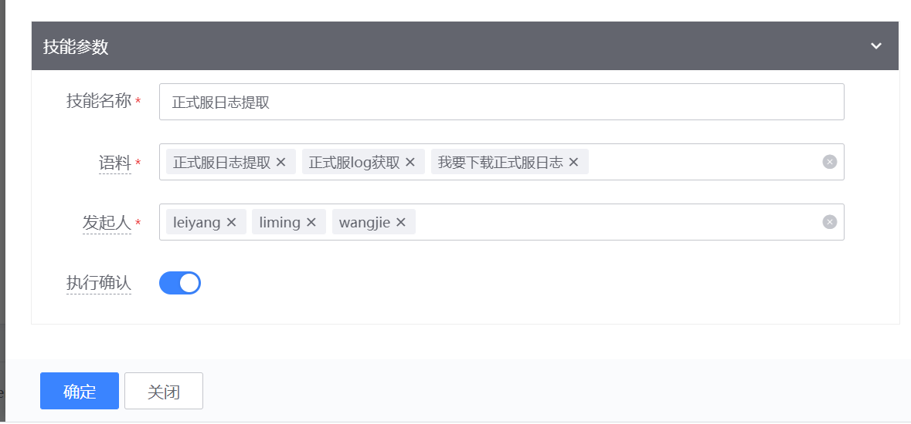
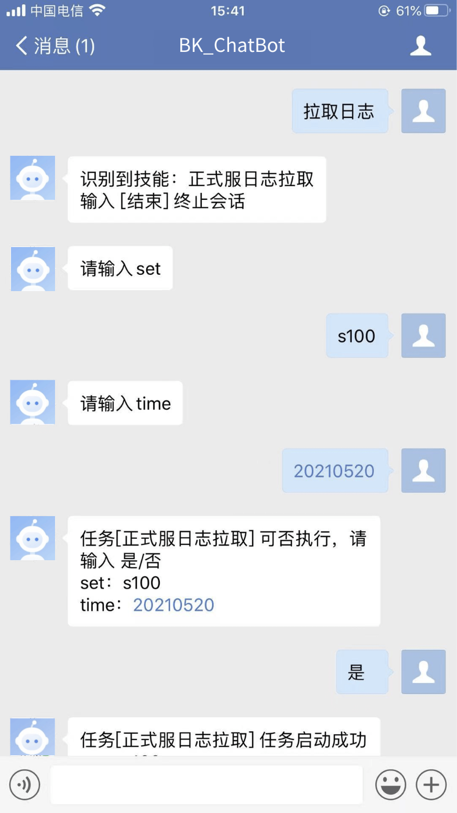

# 技能创建说明

- 点击[技能中心](http://paas.bktencent.com/o/bk-chatbot/intent/list)进行新建技能;
- 任务类型：目前支持蓝鲸上云版**作业平台**、**标准运维**两个插件；
- 任务名称：下拉框模式，您可以下拉选择作业平台下的**执行方案**或标准运维下的**项目流程**；标准运维我们也支持**执行方案分组**
- 选择任务名称后，会自动跳出任务的执行参数（全局变量），我们针对参数进行增删改查的操作，其中标准运维插件，我们只会显示**非隐藏**的全局变量。我们可针对参数指定正则匹配，筋斗云会针对正则进行参数提取，以下截图为案例：

点击参数修改：

我们建立了一个名称为**正式服拉取日志**的**标准运维**作业，其中有两个参数，第一个参数为**大区集群**，我的业务的set命名规则为 `s + 数字`，如s91、s121 等等； 按正则的写法我写为`s[0-9]+`，时间参数一般填写为 20210518 这样的规则， 按正则的写法我写为`20\d{6}` ，正则语法完全可参照python的正则语法规则，同时我们也拥有正则测试的功能如下：

- 再往下，技能参数栏中，我的案例填写如下：

**技能名称**：自己定义的技能名称
**语料**：**这个很重要**，您和机器人交互的时候需要触发此任务的语句，比如任务：正式服日志拉取，我的语料为 正式服日志拉取、获取正式服log、正式服日志下载 等，语料越多，此任务的意图识别会更精准。
**发起人**： 企业微信中谁可以执行此任务，请填写企业微信账号
**执行确认**：开启的话，在任务执行前会和您确认下是/否，您输入**是**，任务才会执行。关闭的话，任务参数一旦获取完毕后无确认环节，直接执行。
对于高危的任务，建议**执行确认开启**
最后，点击**确认**，您的技能就创建好了。此技能只能在你设置的**发起人**才拥有技能执行权限。

- 以下是我与我的企业微信机器人的整体交互过程

  

  执行成功后，你可以到标准运维页面查看任务执行记录
