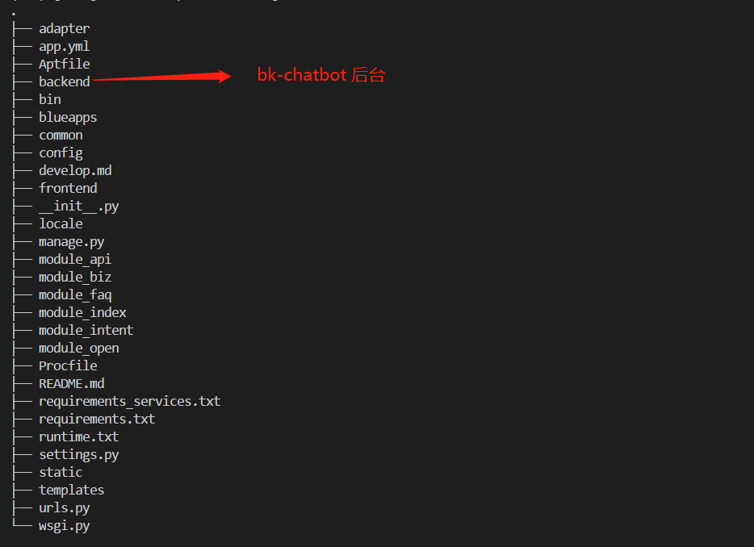

# BK_CHATBOT 部署文档

[TOC]

## 代码目录

* 机器人代码如下

```shell
.
├── LICENSE
├── README.md
├── README_en.md
├── VERSION
├── docs                 # 文档集合
│   ├── CONTRIBUTING.md
│   ├── createskills.md
│   ├── deploy.md
│   ├── release.md
│   ├── resource
│   └── usage.md
├── requirements.txt
├── scripts
│   └── cron.py
└── src
    ├── backend         # 机器人后端
    └── manager         # 机器人管理端代码
```

## 第三方组件

* Redis >= 3.2.11
* 语料库

## 部署介绍

### 1. 部署Redis

请参看官方资料 [Redis](https://redis.io/download)

推荐版本下载： [Redis 3.2.11](http://download.redis.io/releases/redis-3.2.11.tar.gz)

注：可采用蓝鲸官方默认Redis

### 2. 配置数据库

1. Redis需要打开auth认证的功能，并为其配置密码

### 3. Release包下载

官方发布的 **Linux Release** 包下载地址见[这里](https://github.com/TencentBlueKing/bk-chatbot/releases)

### 4. 机器人后台部署

#### 安装包

> 解压

```shell
tar -zxf release.tar.gz 或 unzip release.zip
```

* 包的目录结构如下



> 创建用户配置文件

```shell
cd release && touch config.py
```

> 添加用户自定义配置，引入机器人默认配置，设置唤醒关键词，定义机器人名称

```shell
cd release && vim config.py
```

```shell
import re
from opsbot.default_config import *

RTX_NAME = '我的机器人'
COMMAND_START = ['', re.compile(r'[/!]+')]
API_ROOT = 'https://qyapi.weixin.qq.com/cgi-bin'
```

> 编辑启动文件 config.py, 设置启动Host和Port, 注：该端口要与企业微信应用回调相对应

```shell
HOST = '127.0.0.1'
PORT = 8888
```

> 进入企业微信可查看

* CORPID [查看](http://p.qpic.cn/pic_wework/3036008643/f4f249f8640f1a58ce330176eda833b613ef0c87857592ed/0/)
* SECRET [查看](http://p.qpic.cn/pic_wework/3978463327/cbcd77c7c50cb5da32a41e101af95f6b5a2105e6bf046060/0/)
* TOKEN    用户自定义
* AES_KEY  用户自定义

> 配置IM密钥文件

- [企业微信](slack/secret.md)
- [Slack](slack/secret.md)

> 配置蓝鲸API密钥和路径

* 创建蓝鲸SaaS [查看](https://bk.tencent.com/docs/document/6.0/148/6690)
* 获取应用信息[查看](https://bk.tencent.com/docs/document/6.0/148/6391)
* APP 开API访问白名单[查看](https://bk.tencent.com/docs/document/6.0/148/6696)

```shell
cd release && vim component/config.py
```

```shell
"""
ALL Component Config
Include: BK(APP_ID, APP_SECRET)
"""

BK_APP_ID = ""             # 你的appid
BK_APP_SECRET = ""         # 你的appkey
BK_GET_TOKEN_URL = ""      # 目前不需要
BK_REFRESH_TOKEN_URL = ""  # 目前不需要

BK_PAAS_DOMAIN = ""        # 社区版平台域名
BK_CHAT_DOMAIN = ""        # 留空
BK_JOB_DOMAIN = ""         # 社区版JOB平台域名
BK_SOPS_DOMAIN = ""        # 社区版标准运维域名
BK_DEVOPS_DOMAIN = ""      # 社区版蓝盾域名
BK_ITSM_DOMAIN = ""        # 社区版流程系统域名

BK_CC_ROOT = ""            # 访问蓝鲸cc的根路径 你的domain + /api/c/compapi/v2/cc/  
BK_JOB_ROOT = ""           # 访问蓝鲸JOB的根路径 你的domain + /api/c/compapi/v2/jobv3/
BK_SOPS_ROOT = ""          # 访问蓝鲸SOPS的根路径 你的domain + /api/c/compapi/v2/sops/
BK_DEVOPS_ROOT = ""        # 访问蓝盾的根路径
BACKEND_ROOT = ""          # 访问bk-chatbot的根路径 你的domain + /o/bk-chatbot/

"""
REDIS 路径
"""
REDIS_DB_PASSWORD = '' # 访问密码
REDIS_DB_PORT = 6379   # 默认端口
REDIS_DB_NAME = ''     # redis 启动的地址
```

> 任务执行插件配置

```shell
cd release && vim intent/plugins/task/settings.py
```

```shell
"""
交互配置
"""

SESSISON_FINISHED_MSG = '本次会话结束，您可以开启新的会话'
SESSISON_FINISHED_CMD = '结束'

TASK_ALLOW_CMD = '是'
TASK_REFUSE_CMD = '否'
TASK_EXEC_SUCCESS = '任务启动成功'
TASK_EXEC_FAIL = '任务启动失败'
```

> 更多机器人个性化配置, 请参照

```shell
cd release && cat opsbot/default_config.py
```

#### 启动后台服务

```shell
cd release && ./control start
```

#### 停止后台服务

```shell
cd release && ./control stop
```

#### 容器化部署

> 自行服务器安装Docker环境
> 已经为您编排好了一般Dockerfile文件

```shell
release/src/backend/Dockerfile

请一次性将需要的配置按照环境形式写入Dockerfile
```

> 打包镜像

```shell
docker build -f release/src/backend/Dockerfile --network=host -t {namespace}:{tag} .
```

> 启动镜像

```shell
docker run -d --name {name} -p {port}:{port} {namespace}:{tag}
```

#### IM机器人绑定

- [企业微信](slack/apply.md)
- [Slack](slack/apply.md)

### 5.机器人管理端部署

#### 依赖下载

##### 中间件依赖

* mysql
* redis

##### 环境变量配置

* 代码读取环境变量中的值进行参数设置

```shell
APP_ID="xxx"                        # APP_ID(如果蓝鲸paas部署环境变量中自带)
APP_TOKEN="xxx"                     # APP_TOKEN(如果蓝鲸paas部署环境变量中自带)
BK_PAAS_HOST=""                     # 社区版蓝鲸地址
BKAPP_JOB_VERSION="V3"              # 作业平台版本(默认为V3)
BKAPP_DEVOPS_HOST=""                # 蓝盾访问host
BKAPP_JOB_HOST=""                   # 作业平台host

# redis配置
BKAPP_REDIS_DB_NAME="localhost"     # redis地址(默认为localhost)
BKAPP_REDIS_DB_PASSWORD=""          # redis密码(默认为空)
BKAPP_REDIS_DB_PORT="6379"          # redis端口(默认为6379)

# mysql配置
BKAPP_GCS_MYSQL_NAME=""             # mysql 库名
BKAPP_GCS_MYSQL_USER=""             # mysql 用户
BKAPP_GCS_MYSQL_PASSWORD=""         # mysql 密码
BKAPP_GCS_MYSQL_HOST=""             # mysql host
BKAPP_GCS_MYSQL_PORT=""             # mysql 端口
```

##### python第三方库依赖

* pip下载(setuptools<=57.5.0)

```shell
pip install --upgrade setuptools==57.5.0 # 如果setuptools版本过高先降低版本
pip install -r requirements.txt          # python环境依赖下载
```

#### 服务器启动

* 启动web服务

```shell
gunicorn wsgi -w 4 
```

* 启动celery

```shell
python manage.py celery worker -l info
python manage.py celery beat -l info
```

### 6.其他

> 社区版HOST配置

```shell
{你社区版nginx所在服务器} {你自定义的域名} 
```

> bk-chatbot 后台服务启动地址跟企业微信回调地址一致 否则收不到消息

