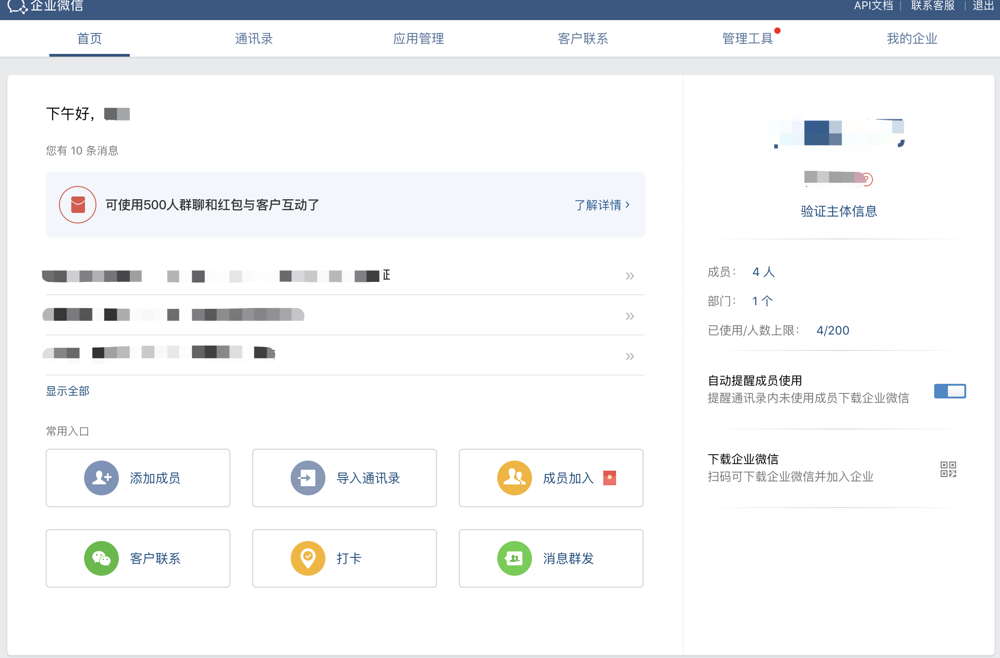
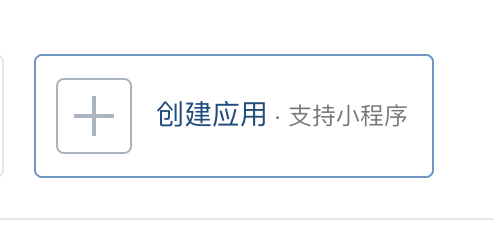
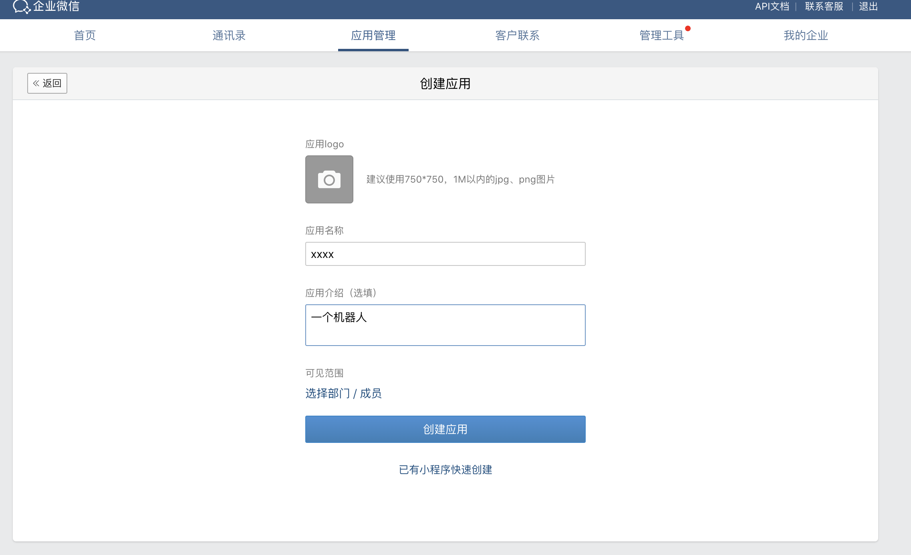
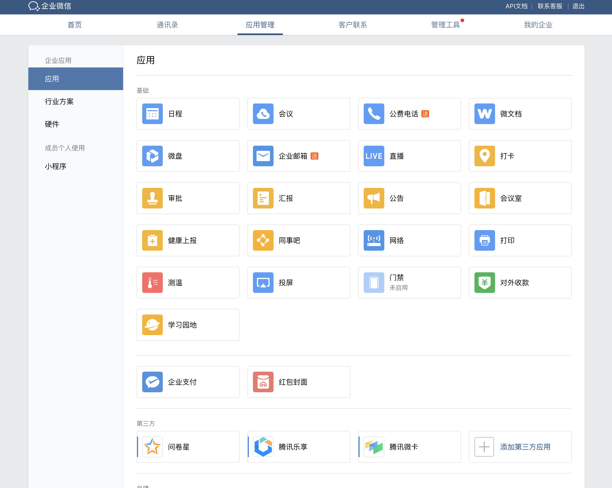
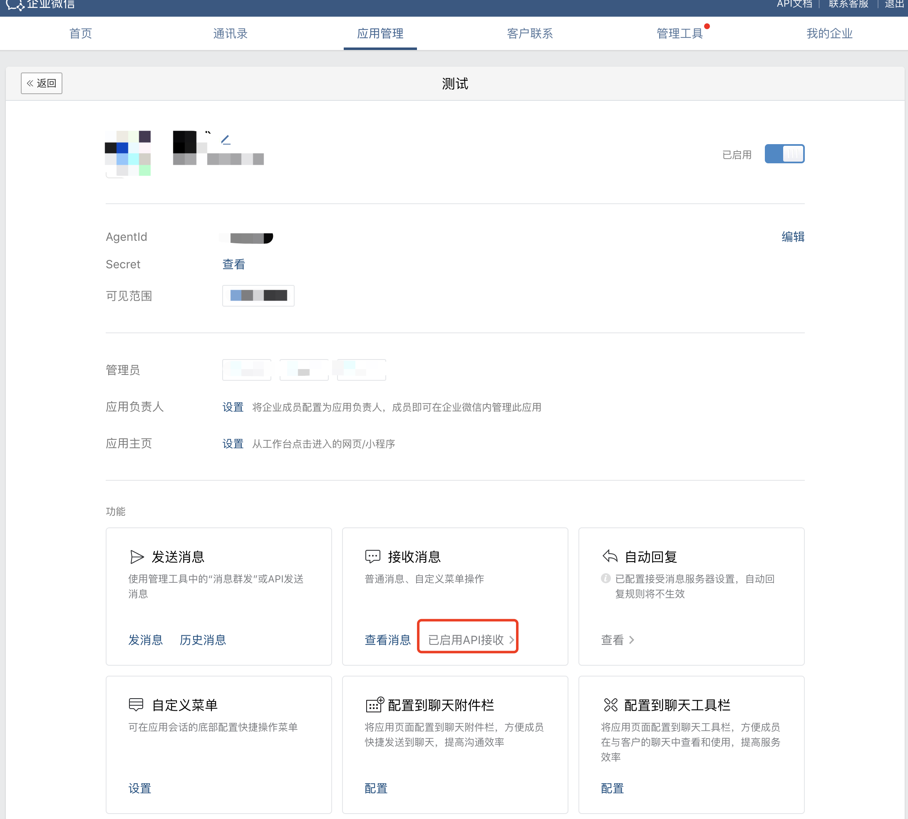
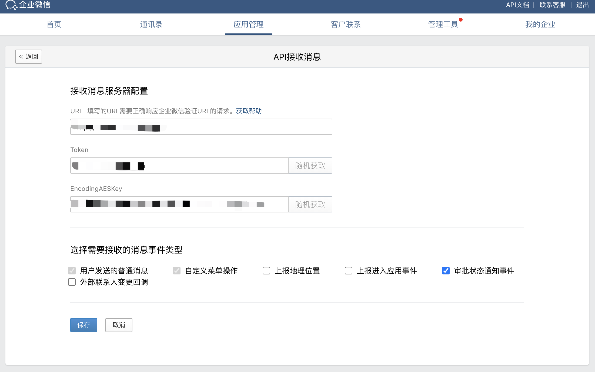

# BK_CHATBOT 部署文档


## 依赖第三方组件

* Redis >= 3.2.11
* 语料库

## 后台服务进程

* bk_chatbot_server

## 部署介绍

### 1. 部署Redis

请参看官方资料 [Redis](https://redis.io/download)

推荐版本下载： [Redis 3.2.11](http://download.redis.io/releases/redis-3.2.11.tar.gz)

注：可采用蓝鲸官方默认Redis

### 2. 配置数据库

1. Redis需要打开auth认证的功能，并为其配置密码

### 3. Release包下载

官方发布的 **Linux Release** 包下载地址见[这里](https://github.com/Tencent/bk-chatbot/releases)


### 4. 机器人后台部署

#### 安装包
> 下载
```shell
git clone https://github.com/TencentBlueKing/bk-chatbot.git
cd bk-chatbot
pip install poetry
poetry shell
poetry update
```
> 解压
```
tar -zxf release.tar.gz 或 unzip release.zip
```
* 包的目录结构如下


> 创建用户配置文件
```
cd release && touch config.py
```
> 添加用户自定义配置，引入机器人默认配置，设置唤醒关键词，定义机器人名称
```
cd release && vim config.py
```

```
import re
from opsbot.default_config import *

RTX_NAME = '我的机器人'
COMMAND_START = ['', re.compile(r'[/!]+')]
API_ROOT = 'https://qyapi.weixin.qq.com/cgi-bin'
```
> 编辑启动文件 config.py, 设置启动Host和Port, 注：该端口要与企业微信应用回调相对应
```
HOST = '127.0.0.1'
PORT = 8888
```
> 进入企业微信可查看
* CORPID [查看](http://p.qpic.cn/pic_wework/3036008643/f4f249f8640f1a58ce330176eda833b613ef0c87857592ed/0/)
* SECRET [查看](http://p.qpic.cn/pic_wework/3978463327/cbcd77c7c50cb5da32a41e101af95f6b5a2105e6bf046060/0/)
* TOKEN    用户自定义
* AES_KEY  用户自定义 

> 配置企业微信密钥文件
```
cd release && vim protocol/xwork/config.py
```

```
"""
Xwork configurations.
"""

CORPID = "必填"   # 企业微信所属企业ID 
FWID = ""
SERVICE_ID = ""
SECRET = "必填"   # 企业微信专属密钥
TOKEN = "必填"    # 企业微信应用自定义Token
AES_KEY = "必填"  # 企业微信应用自定义 aes
```

> 配置蓝鲸API密钥和路径
* 创建蓝鲸SaaS [查看](https://bk.tencent.com/docs/document/6.0/148/6690)
* 获取应用信息[查看](https://bk.tencent.com/docs/document/6.0/148/6391)
* APP 开API访问白名单[查看](https://bk.tencent.com/docs/document/6.0/148/6696)

```
cd release && vim component/config.py
```

```
"""
ALL Component Config
Include: BK(APP_ID, APP_SECRET)
"""

BK_APP_ID = ""             # 你的appid
BK_APP_SECRET = ""         # 你的appkey
BK_GET_TOKEN_URL = ""      # 目前不需要
BK_REFRESH_TOKEN_URL = ""  # 目前不需要

BK_PAAS_DOMAIN = ""        # 社区版平台域名
BK_CHAT_DOMAIN = ""        # 留空
BK_JOB_DOMAIN = ""         # 社区版JOB平台域名
BK_SOPS_DOMAIN = ""        # 社区版标准运维域名
BK_DEVOPS_DOMAIN = ""      # 社区版蓝盾域名
BK_ITSM_DOMAIN = ""        # 社区版流程系统域名

BK_CC_ROOT = ""            # 访问蓝鲸cc的根路径 你的domain + /api/c/compapi/v2/cc/  
BK_JOB_ROOT = ""           # 访问蓝鲸JOB的根路径 你的domain + /api/c/compapi/v2/jobv3/
BK_SOPS_ROOT = ""          # 访问蓝鲸SOPS的根路径 你的domain + /api/c/compapi/v2/sops/
BK_DEVOPS_ROOT = ""        # 访问蓝盾的根路径
BACKEND_ROOT = ""          # 访问bk-chatbot的根路径 你的domain + /o/bk-chatbot/

"""
REDIS 路径
"""
REDIS_DB_PASSWORD = '' # 访问密码
REDIS_DB_PORT = 6379   # 默认端口
REDIS_DB_NAME = ''     # redis 启动的地址
```

> 任务执行插件配置

```
cd release && vim intent/plugins/task/settings.py
```

```
"""
交互配置
"""

SESSISON_FINISHED_MSG = '本次会话结束，您可以开启新的会话'
SESSISON_FINISHED_CMD = '结束'

TASK_ALLOW_CMD = '是'
TASK_REFUSE_CMD = '否'
TASK_EXEC_SUCCESS = '任务启动成功'
TASK_EXEC_FAIL = '任务启动失败'
```

> 更多机器人个性化配置, 请参照

```
cd release && cat opsbot/default_config.py
```

#### 启动后台服务

```
cd release && ./control start
```

#### 停止后台服务

```
cd release && ./control stop
```

#### 容器化部署
> 自行服务器安装Docker环境

> 已经为您编排好了一般Dockerfile文件

```
release/src/backend/Dockerfile

请一次性将需要的配置按照环境形式写入Dockerfile
```

> 打包镜像
```
docker build -f release/src/backend/Dockerfile --network=host -t {namespace}:{tag} .
```

> 启动镜像

```
docker run -d --name {name} -p {port}:{port} {namespace}:{tag}
```

### 5. 管理端部署
> 环境变量配置
```shell
# 可以根据用到的功能进行自定义配置，不配置默认设置xxx即可

# 环境配置
export BK_PAAS_HOST="http://paas.bktencent.com/"         # 私有化部署的蓝鲸paas的host
export APP_ID="xxx"                                      # 项目对应的APP_ID
export APP_TOKEN="xxx"                                   # 项目对应的APP_TOKEN
export BKAPP_JOB_HOST="xxx"                              # job平台host
export BKAPP_DEVOPS_HOST="xxx"                           # 蓝盾平台host

# 发布环境配置mysql(测试环境可以在config/dev.py里面直接修改)
export BKAPP_GCS_MYSQL_HOST="127.0.0.1"
export BKAPP_GCS_MYSQL_PORT="3306"
export BKAPP_GCS_MYSQL_NAME="bkchat"
export BKAPP_GCS_MYSQL_USER="root"
export BKAPP_GCS_MYSQL_PASSWORD="root"

# module_plugin 模块用到的环境变量
export PLUGIN_ITSM_SERVICE_ID="xxx"   # itsm审核单据
export PLUGIN_ITSM_CALLBACK_URI="xxx" # itsm回调接口
export PLUGIN_RELOAD_URI="xxx"        # 插件重载接口
export PROD_BOT_NAME="xxx"            # 正式环境机器人名称
export STAG_BOT_NAME="xxx"            # 预发布环境机器人名称

# module_timer 模块用到的环境变量
export TIMER_USER_NAME="xxx"   # 定时任务执行人
export TIMER_BIZ_ID="xxx"      # 定时任务用到job平台的项目ID
export TIMER_JOB_PLAN_ID="xxx" # 定时任务用到job平台执行方案的ID
```

> 项目启动

```shell
python manage.py makemigrations
python manage.py migrate
python manage.py runserver 
```

### 6. 企业微信绑定
> 企业微信后台
* [打开](https://work.weixin.qq.com/wework_admin)



> 创建应用
* 进入 应用管理 -> [创建应用](https://work.weixin.qq.com/wework_admin/frame#apps/createApiApp)





> 应用管理
* 点击应用





> 注册回调
* 后台启动服务
* 测试注册 (注：这里url要填写你后台服务部署的外网IP，确保端口开通)



### 8. 其他
> 社区版HOST配置
```
{你社区版nginx所在服务器} {你自定义的域名} 
```
> bk-chatbot 后台服务启动地址跟企业微信回调地址一致 否则收不到消息