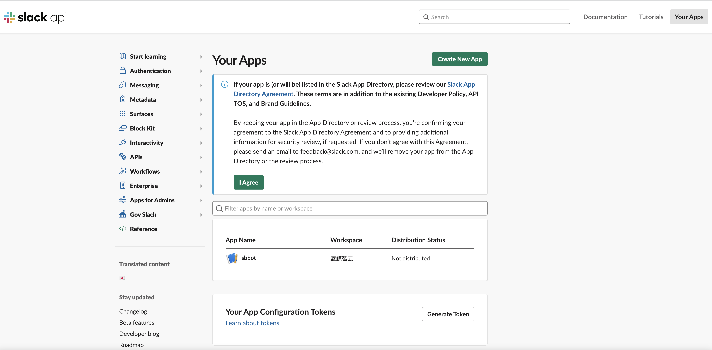
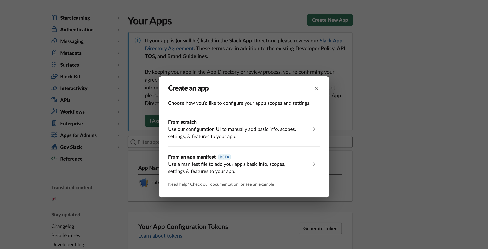
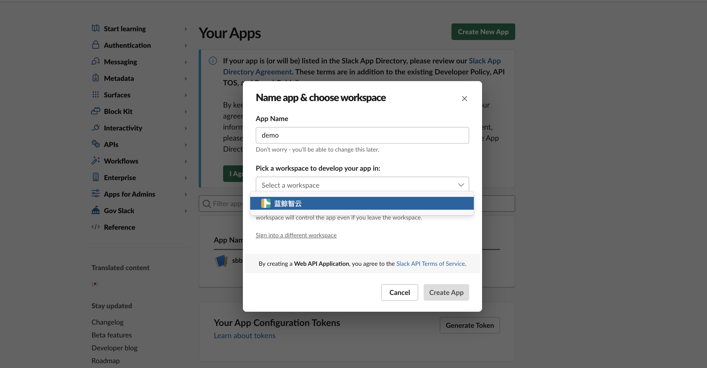
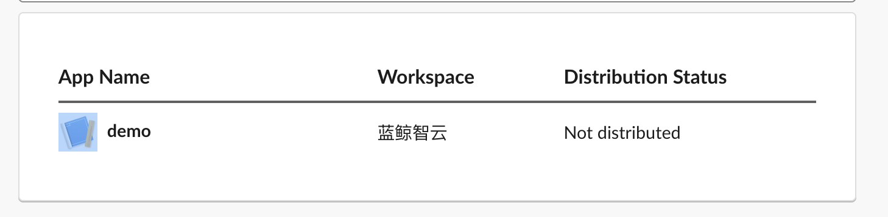
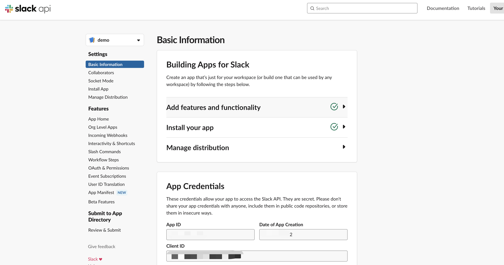
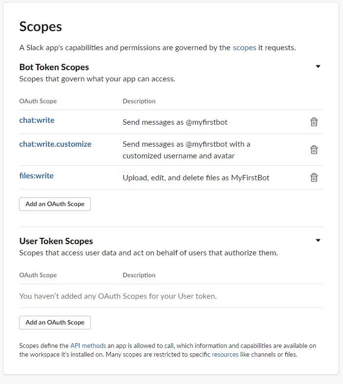
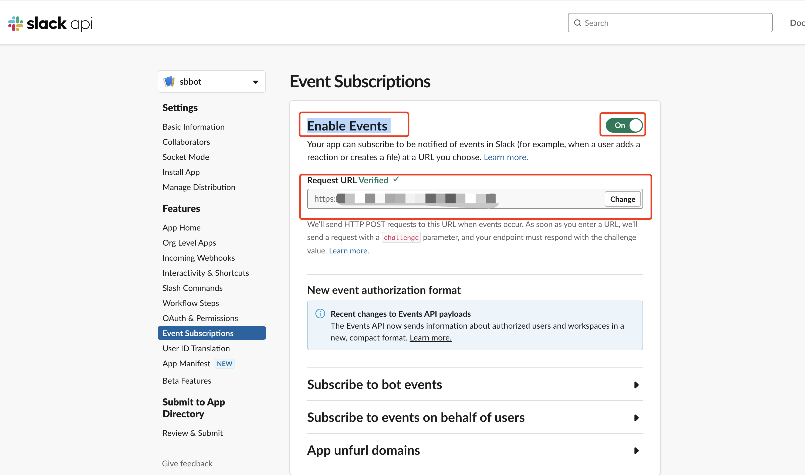
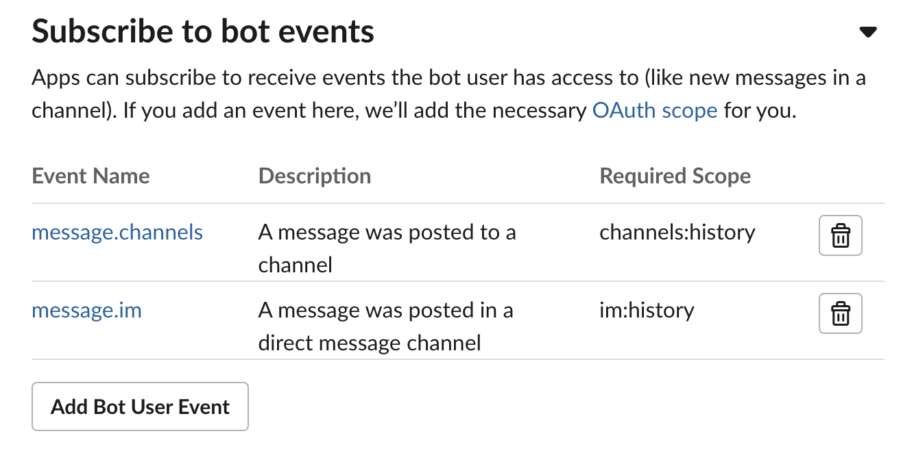
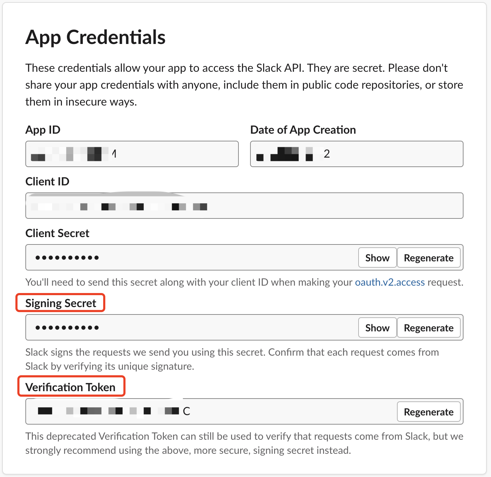
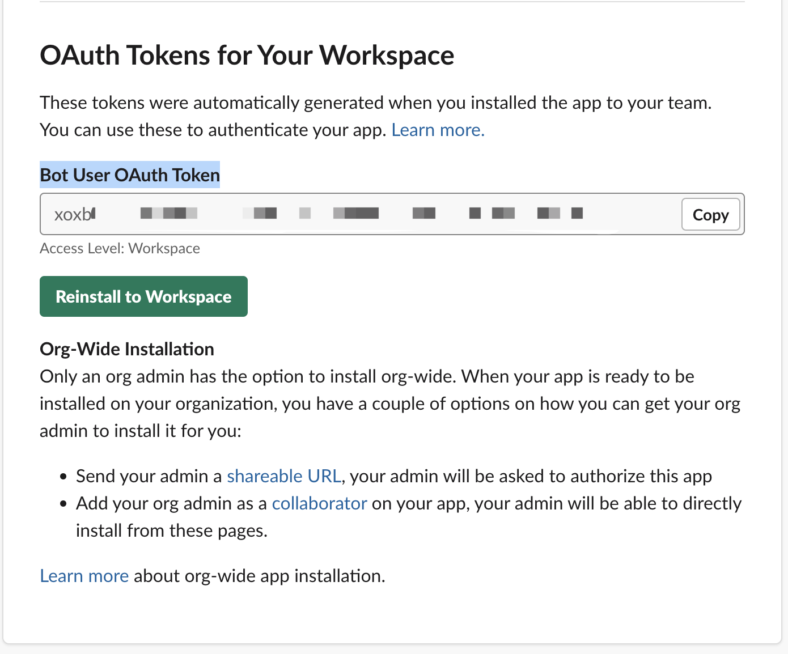

# Slack应用申请

[TOC]

## 应用创建

> Slack后台

* [打开](https://api.slack.com/apps/)

> 创建应用

* 点击右上角按钮 `Create New App` 按钮进入创建子页面

* 选择 `From scratch` 方式，输入 `App Name` 和 `Workspace`

* 点击 `Create App` 按钮确认创建，并在下方找到你创建的应用

> 配置应用

* 点击应用名称进入你的应用配置

* 选择 `OAuth & Permissions`，往下面拉找到 `Scopes`，在 `Bot Token Scopes` 的部分按下 `Add an OAuth Scope` 添加应用在channel中获取收发消息的权限，至少添加 `chat:write, chat:write:customize, files:write`

* 选择 `Event Subscriptions` 配置回调，前提你需要有一个能够接收slack请求的域名并配置https证书
* 打开 `Enable Events` 开关，输入你的回调域名, slack会验证你的域名合法性，同时会给你的域名发送验证请求，具体验证方式请[点击](https://api.slack.com/events/url_verification)

* 打开 `Subscribe to bot events` 选择订阅的事件，点击`Add user bot event` 勾选im和channels，这样会同时接收私聊和频道的事件

> 密钥获取

* 在`Basic Information` 页面获取`Signing Secret` 和 `Verification Token`

* 在`OAuth & Permissions` 页面获取`Bot User OAuth Token`

