# 技能执行使用说明

1、当前版本为免技能创建模式，直接打开已配置的应用号，输入“1”或者 “help” ， 点击消息右上角，会弹出对应的操作，可进行业务的绑定。

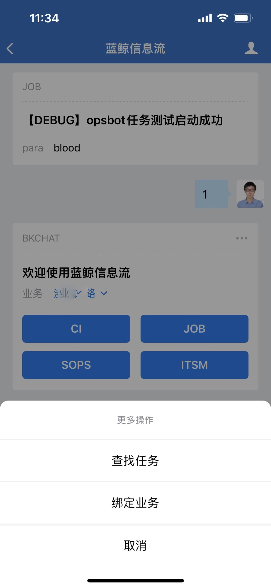

2、蓝盾CI执行， 点击 “CI” ， 弹出选择“蓝盾项目”，选择后继续选择蓝盾的”流水线“，到最终的执行

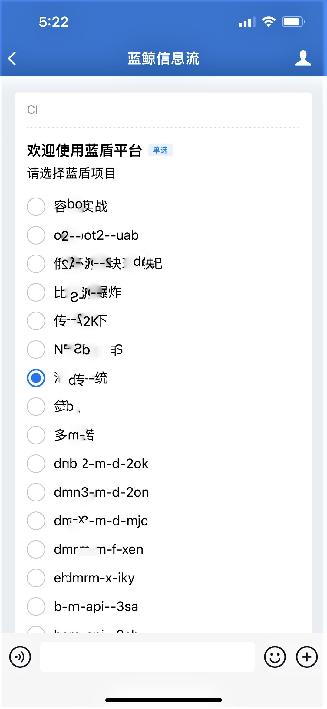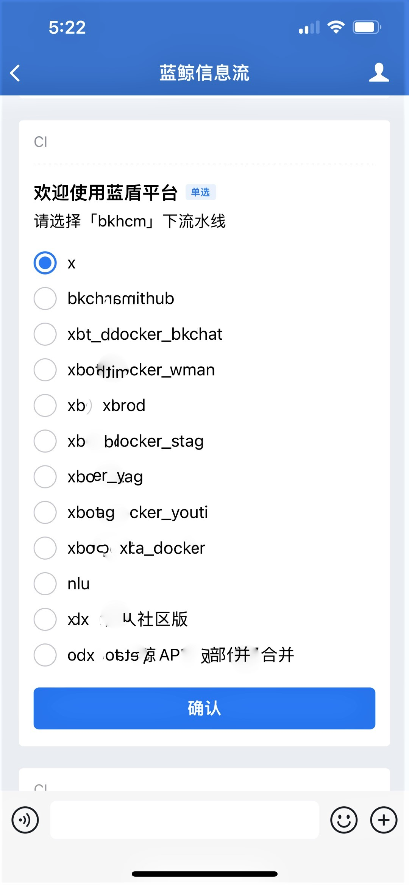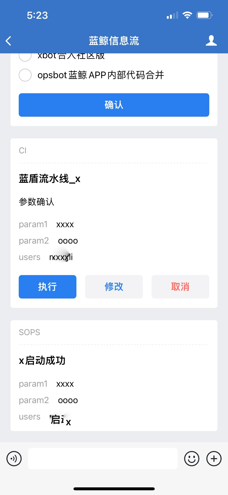

3、标准运维执行, 支持“分组”模式的选择

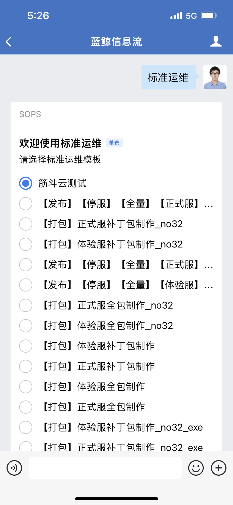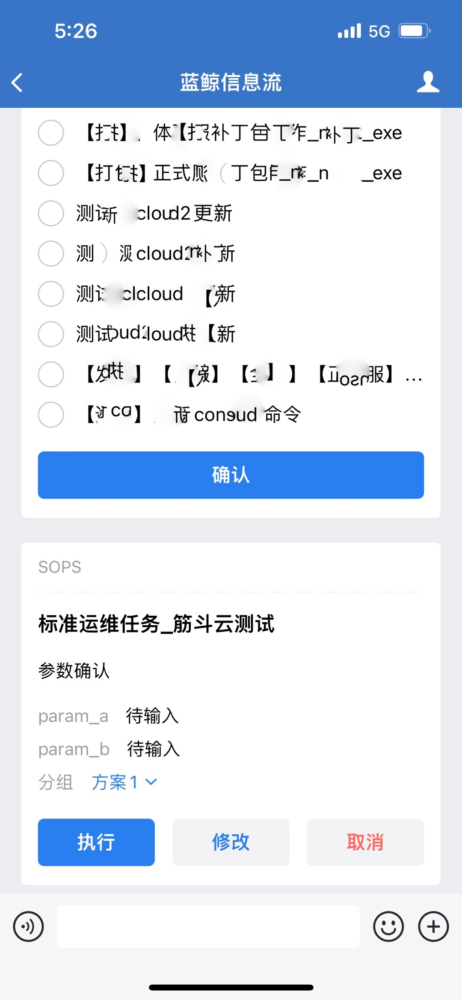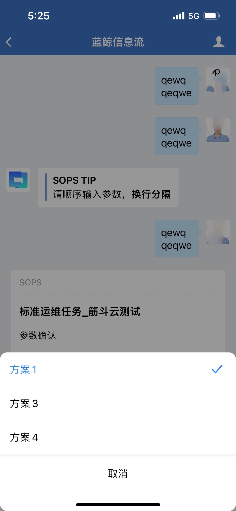

4、我们同时支持任务查找的功能，如下，您可自由输入你想要执行的任务，后台会给您匹配到最佳的任务。

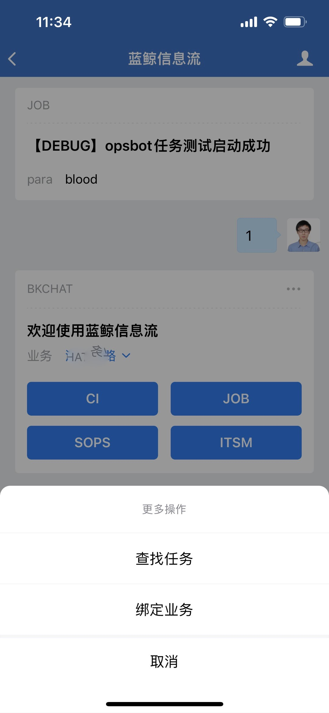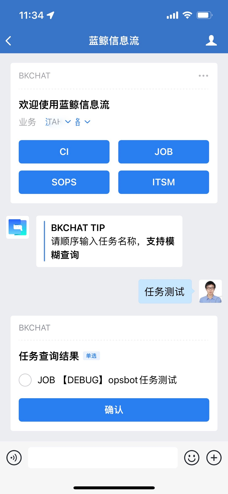

5、语音交互样例展示

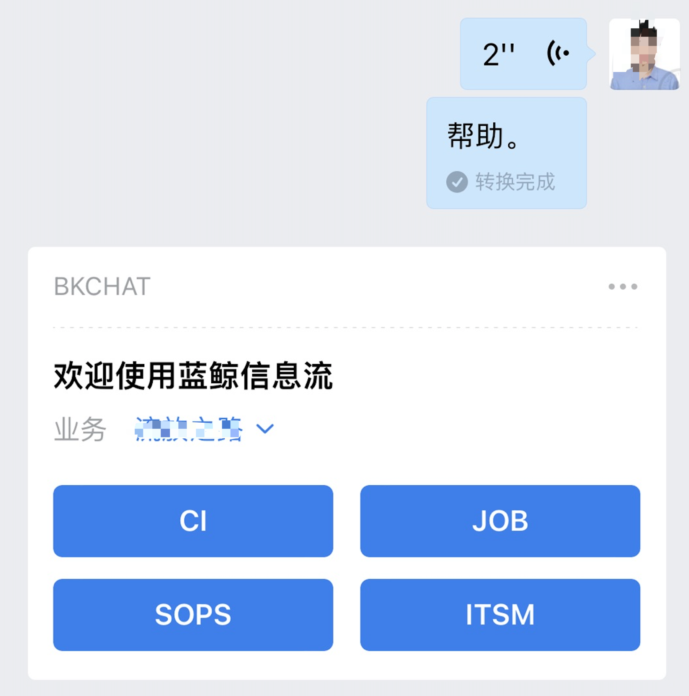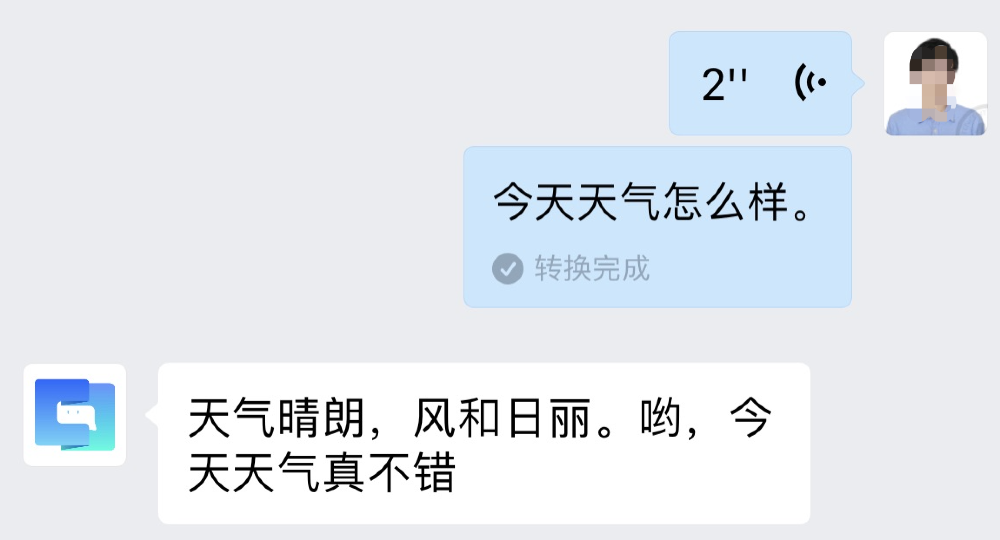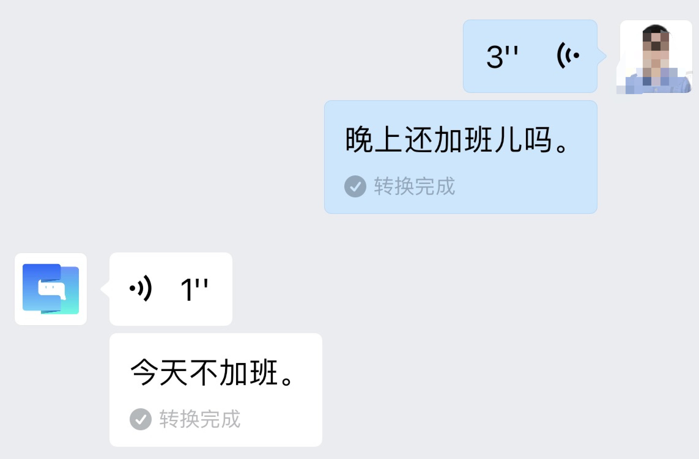
